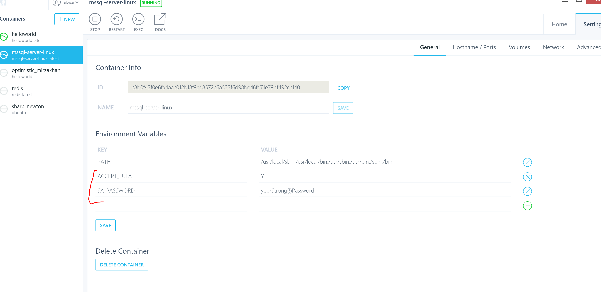

# Fire up your first container
```docker
docker run -it helloworld
```


# A bit more would be nice ...
```docker
docker run -it ubuntu bin/bash
```

```bash
# List information about the FILEs (the current directory by default).
ls

echo hello from my first container
# print your current user
whoami

```


Docker cli has great documentation either with --help at the end of a command or online.

```docker 

docker run --help

Usage:  docker run [OPTIONS] IMAGE [COMMAND] [ARG...]

Run a command in a new container

Options:
      --add-host list                         Add a custom host-to-IP mapping (host:ip) (default [])
  -a, --attach list                           Attach to STDIN, STDOUT or STDERR (default [])
      --blkio-weight uint16                   Block IO (relative weight), between 10 and 1000, or 0 to disable (default 0)
      --blkio-weight-device weighted-device   Block IO weight (relative device weight) (default [])
      --cap-add list                          Add Linux capabilities (default [])
      --cap-drop list                         Drop Linux capabilities (default [])
      --cgroup-parent string                  Optional parent cgroup for the container
      --cidfile string                        Write the container ID to the file
      --cpu-count int                         CPU count (Windows only)
      --cpu-percent int                       CPU percent (Windows only)
      --cpu-period int                        Limit CPU CFS (Completely Fair Scheduler) period
      --cpu-quota int                         Limit CPU CFS (Completely Fair Scheduler) quota
      --cpu-rt-period int                     Limit CPU real-time period in microseconds
      --cpu-rt-runtime int                    Limit CPU real-time runtime in microseconds
  -c, --cpu-shares int                        CPU shares (relative weight)
      --cpus decimal                          Number of CPUs (default 0.000)
      --cpuset-cpus string                    CPUs in which to allow execution (0-3, 0,1)
      --cpuset-mems string                    MEMs in which to allow execution (0-3, 0,1)
      --credentialspec string                 Credential spec for managed service account (Windows only)
  -d, --detach                                Run container in background and print container ID
      --detach-keys string                    Override the key sequence for detaching a container
      --device list                           Add a host device to the container (default [])
      --device-read-bps throttled-device      Limit read rate (bytes per second) from a device (default [])
      --device-read-iops throttled-device     Limit read rate (IO per second) from a device (default [])
      --device-write-bps throttled-device     Limit write rate (bytes per second) to a device (default [])
      --device-write-iops throttled-device    Limit write rate (IO per second) to a device (default [])
      --disable-content-trust                 Skip image verification (default true)
      --dns list                              Set custom DNS servers (default [])
      --dns-option list                       Set DNS options (default [])
      --dns-search list                       Set custom DNS search domains (default [])
      --entrypoint string                     Overwrite the default ENTRYPOINT of the image
  -e, --env list                              Set environment variables (default [])
      --env-file list                         Read in a file of environment variables (default [])
      --expose list                           Expose a port or a range of ports (default [])
      --group-add list                        Add additional groups to join (default [])
      --health-cmd string                     Command to run to check health
      --health-interval duration              Time between running the check (ns|us|ms|s|m|h) (default 0s)
      --health-retries int                    Consecutive failures needed to report unhealthy
      --health-timeout duration               Maximum time to allow one check to run (ns|us|ms|s|m|h) (default 0s)
      --help                                  Print usage
  -h, --hostname string                       Container host name
      --init                                  Run an init inside the container that forwards signals and reaps processes
      --init-path string                      Path to the docker-init binary
  -i, --interactive                           Keep STDIN open even if not attached
      --io-maxbandwidth string                Maximum IO bandwidth limit for the system drive (Windows only)
      --io-maxiops uint                       Maximum IOps limit for the system drive (Windows only)
      --ip string                             Container IPv4 address (e.g. 172.30.100.104)
      --ip6 string                            Container IPv6 address (e.g. 2001:db8::33)
      --ipc string                            IPC namespace to use
      --isolation string                      Container isolation technology
      --kernel-memory string                  Kernel memory limit
  -l, --label list                            Set meta data on a container (default [])
      --label-file list                       Read in a line delimited file of labels (default [])
      --link list                             Add link to another container (default [])
      --link-local-ip list                    Container IPv4/IPv6 link-local addresses (default [])
      --log-driver string                     Logging driver for the container
      --log-opt list                          Log driver options (default [])
      --mac-address string                    Container MAC address (e.g. 92:d0:c6:0a:29:33)
  -m, --memory string                         Memory limit
      --memory-reservation string             Memory soft limit
      --memory-swap string                    Swap limit equal to memory plus swap: '-1' to enable unlimited swap
      --memory-swappiness int                 Tune container memory swappiness (0 to 100) (default -1)
      --name string                           Assign a name to the container
      --network string                        Connect a container to a network (default "default")
      --network-alias list                    Add network-scoped alias for the container (default [])
      --no-healthcheck                        Disable any container-specified HEALTHCHECK
      --oom-kill-disable                      Disable OOM Killer
      --oom-score-adj int                     Tune host's OOM preferences (-1000 to 1000)
      --pid string                            PID namespace to use
      --pids-limit int                        Tune container pids limit (set -1 for unlimited)
      --privileged                            Give extended privileges to this container
  -p, --publish list                          Publish a container's port(s) to the host (default [])
  -P, --publish-all                           Publish all exposed ports to random ports
      --read-only                             Mount the container's root filesystem as read only
      --restart string                        Restart policy to apply when a container exits (default "no")
      --rm                                    Automatically remove the container when it exits
      --runtime string                        Runtime to use for this container
      --security-opt list                     Security Options (default [])
      --shm-size string                       Size of /dev/shm, default value is 64MB
      --sig-proxy                             Proxy received signals to the process (default true)
      --stop-signal string                    Signal to stop a container, 15 by default (default "15")
      --stop-timeout int                      Timeout (in seconds) to stop a container
      --storage-opt list                      Storage driver options for the container (default [])
      --sysctl map                            Sysctl options (default map[])
      --tmpfs list                            Mount a tmpfs directory (default [])
  -t, --tty                                   Allocate a pseudo-TTY
      --ulimit ulimit                         Ulimit options (default [])
  -u, --user string                           Username or UID (format: <name|uid>[:<group|gid>])
      --userns string                         User namespace to use
      --uts string                            UTS namespace to use
  -v, --volume list                           Bind mount a volume (default [])
      --volume-driver string                  Optional volume driver for the container
      --volumes-from list                     Mount volumes from the specified container(s) (default [])
  -w, --workdir string                        Working directory inside the container

```

# Basic commanding

## Inspect your daemon

```docker
# shows running containers
docker ps
```

```docker
# shows all containers (running and stopped)
docker ps -a
```

```docker
# try it ou ...
docker ps -q
```

```docker
# shows the stdout of a container
docker logs {container Id}
```

```docker
# shows information about networking, volumes, environment vars ...
docker inspect {container Id}
```

## Stop, kill and remove a container


```docker
# if you don't want to be nice
docker kill myfirst
```

```docker
# gracefully exit
docker stop myfirst
```

```docker
# remove a container
docker rm myfirst
```

```docker
# removes all containers stopped containers.
docker container prune
```
## More tips 
- [remove all containers](https://docs.docker.com/engine/reference/commandline/container_prune/)

- [Getting some insights about disk usage, events ...](https://docs.docker.com/engine/reference/commandline/system/#usage)

# Finally some web stuff

## run your web app

```
# interactive
docker run -it -p 8080:80 karthequian/helloworld

# detached mode 
docker run -d -p 8080:80 karthequian/helloworld
```


# play around with kitematic

For the windows guys
1. right click your tray icon of docker
2. open kitematic

## run helloworld

1. search for the karthequian/helloworld image on docker hub
2. run it with different ports, restart, stop it.

## run mssql-linux

1. run `microsoft/mssql-server-linux:latest`
2. connect to it with your sql-server management studio. (connect to localhost,port exposed)

